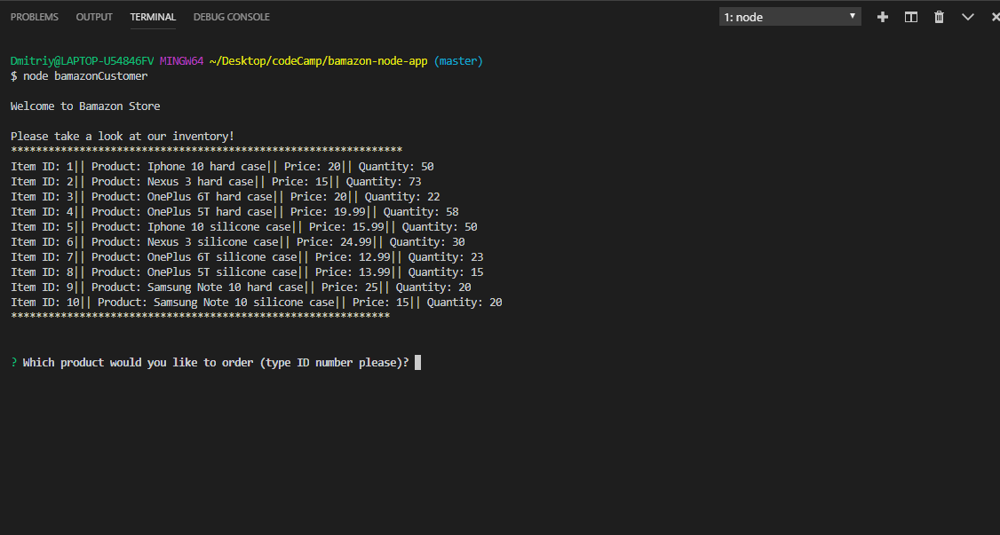
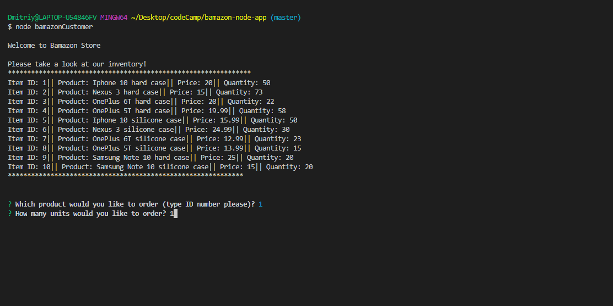
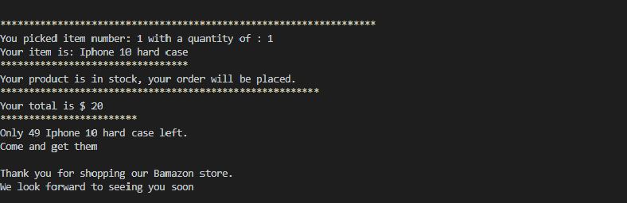
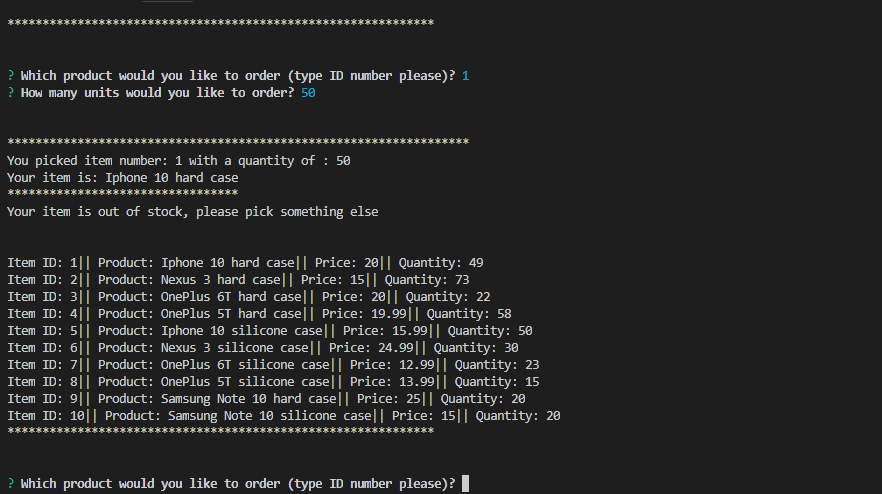

# Bamazon Node App
## Overview
Amazon-like storefront with the MySQL.

## App Specifications
* Bamazon Customer
    * App displays all products
    * App asks users what product they want to buy and how many.
    * App updates store quantity and informs user the total cost of purchase

## NPM Packages Used
* inquirer
* mysql
## How to Run
* Download repository
* Run schema.sql and seeds.sql to create and populate bamazon tables on your database (if not already created)
* Install npm packages
## Run applications:
* "node bamazonCustomer.js"

## Examples
* 
* 
* 
* 
## Video
[Google Drive](https://drive.google.com/open?id=1-TJFa7nqt1b-Wwyr8n0V0n30-BJjB_11)
## Technologies Used
* JavaScript
* NodeJs
